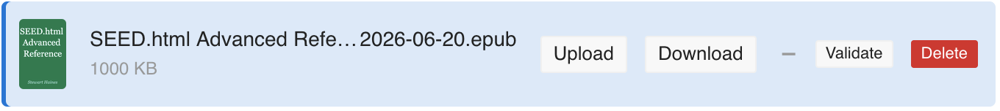
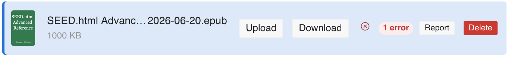
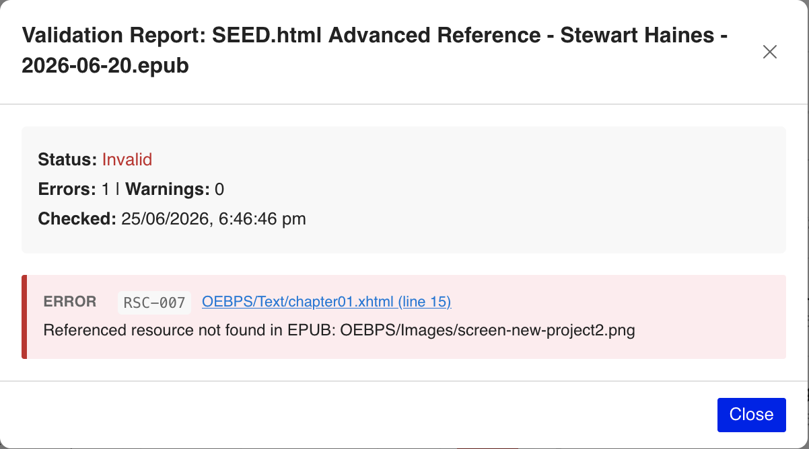
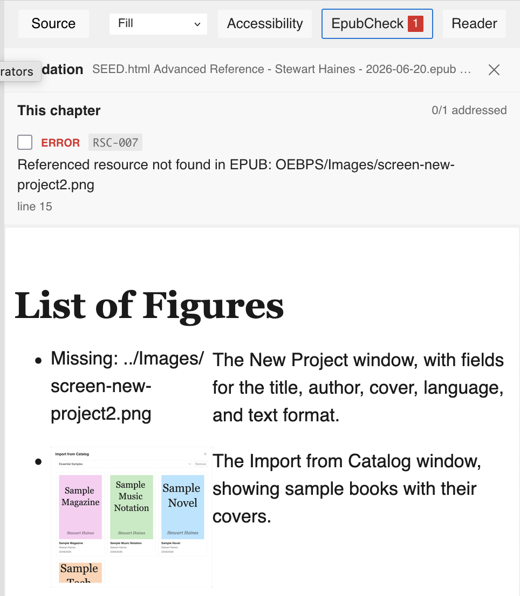

# The publish-to-remote plugin

App Settings has a **Plugins** group with a single plugin: **publish-to-remote**, switched on there. This chapter is what it does.

## Validation

The plugin's broadly useful feature has little to do with remotes. With it enabled, a **Validate** action runs **EPUBCheck** — the EPUB standard's official conformance checker — over your packaged book and shows the result in a modal: the errors and warnings it found, or a clean pass.

{.figure}

{.figure}

Many issues belong to a particular chapter. Where one does, the report links straight to it, and that chapter's preview header gains an **EpubCheck** button listing just its issues — so you can work through a chapter against its own errors instead of scanning the whole report.

{.figure}

{.figure}

EPUBCheck is the surest way to know an EPUB is well-formed before you hand it on — the validation the earlier chapters pointed forward to: package the book, validate it, and fix anything it flags.

## Remotes

The plugin uploads a packaged EPUB straight to a remote you've configured — an S3 or R2 bucket, WebDAV, Google Drive, or Dropbox. Credentials are entered at runtime and kept per-remote in the browser's private storage; nothing is baked into the build, and you bring your own.

Of the four, the one worth setting up is an **S3-compatible bucket** — and it can cost nothing. Cloudflare's **R2** has a free tier with no egress fees (several other S3-compatible providers offer free tiers too); create a bucket, give it a public URL, and you have a real, durable home to publish to — a stable address per book rather than a file you re-send each time. It's a small bit of setup that pays for itself the moment you publish more than once.

The other three are weaker. With **Google Drive** or **Dropbox** it's usually simpler to download the EPUB and drop it into a synced folder yourself; **WebDAV** works only where the server is configured to allow cross-origin (CORS) uploads. If you're going to configure a remote at all, make it an S3 or R2 bucket.

## Publishing

With a remote configured, the plugin's pane lists your packaged EPUBs and the files already on the remote; publishing uploads a book, and you can delete remote files from the same place. When you're serving books from a real host — the S3/R2 case — it can also keep an **OPDS catalogue** beside them: a small feed an OPDS-aware reading app can browse and subscribe to, rather than opening one file at a time. Worth it for a shelf of books; unnecessary for a single title.
